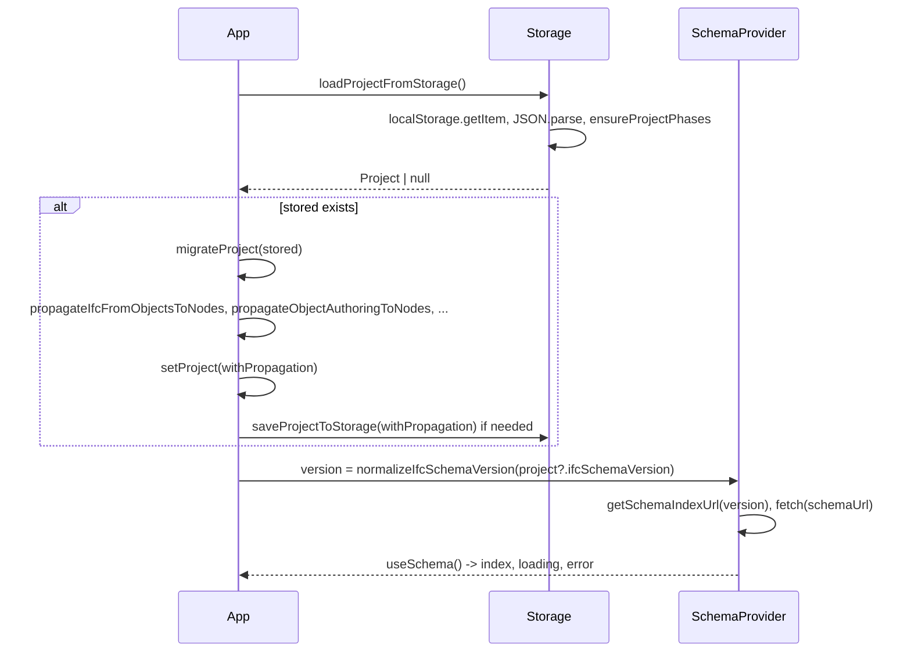

# Datové toky

Tento dokument popisuje hlavní datové toky v aplikaci: načtení a ukládání projektu, načtení schématu podle verze, průchod dat z importu do projektu a do UI, export IDS/Excel a odkud se bere IFC verze. Při změně toků (kde se co načítá/ukládá, kdo čte verzi) tento soubor aktualizujte.

---

## 1. Načtení projektu při startu



- **localStorage** klíč projektu: `inforeqapp:project`.
- **loadProjectFromStorage** vrací projekt po `ensureProjectPhases`; **nemigruje**.
- **Migrace a propagace** probíhají v App: `migrateProject(stored)` pak řada `propagate*`; výsledek se nastaví do stavu a případně uloží zpět.
- **SchemaProvider** dostává `version` z App (z `project?.ifcSchemaVersion`). Při změně verze (např. po uložení v ProjectDetailsDialog) se změní prop `version` → SchemaProvider přenačte schema (useEffect na schemaUrl).

---

## 2. Načtení schématu podle verze

```mermaid
flowchart LR
  subgraph App
    project[project state]
    version[version = normalizeIfcSchemaVersion(project?.ifcSchemaVersion)]
  end
  subgraph SchemaProvider
    schemaUrl[getSchemaIndexUrl(version)]
    fetch[fetch schema JSON]
    index[SchemaIndex]
  end
  project --> version
  version --> schemaUrl
  schemaUrl --> fetch
  fetch --> index
  index --> useSchema
```

- **Zdroj verze:** vždy z projektu v App (`project?.ifcSchemaVersion`). Pokud projekt není (prázdný stav), použije se normalizovaná hodnota (výchozí z konfigu).
- **SchemaProvider** v useEffect při změně `schemaUrl` načte odpovídající soubor z `public/ifc/` (schema_index_ifc4.json nebo schema_index_ifc4x3.json). Tyto soubory se generují skriptem `build_schema_index.ts` ze slovníku (IFC_4x3.json / IFC_4.json), XSD a XML Pset/Qto – viz [schema-and-version.md](schema-and-version.md) (zdroje dat).
- **useSchema()** vrací jeden index – ten, který odpovídá aktuální verzi. Všechny komponenty, které potřebují schema, ho dostávají z App (prop schemaIndex).

---

## 3. Změna IFC verze v UI

1. Uživatel otevře Údaje projektu (ProjectDetailsDialog).
2. Změní pole „Verze IFC schématu“ (select: IFC4 / IFC 4.3).
3. Při uložení dialog nastaví `project.ifcSchemaVersion`, `project.ifcSchemaVersionDisplay` a výchozí `project.ifcDocumentationUrl` z konfigu (getDisplayLabel, getIfcDocumentationBaseUrl).
4. App uloží projekt (setProject, saveProjectToStorage).
5. SchemaProvider dostane novou prop `version` → změní se `schemaUrl` → useEffect přenačte nový schema index.
6. Komponenty používající useSchema() nebo props (schemaIndex, ifcSchemaVersion) začnou používat nové schema a nové URL (ObjectDetail, ClassificationManager, TranslatedLabel, export).

---

## 4. Import IDS / Excel do projektu

**IDS:**

1. Uživatel nahraje IDS soubor. App parsuje přes import/ids (parseIdsFile).
2. App volá `mergeIdsIntoProject(parsed, project, schemaIndex ?? null)`. Merge potřebuje schemaIndex pro normalizaci kódů a pro buildClassificationFromSchemaFiltered.
3. Výsledek je nový/upravený projekt; App nastaví setProject(merged) a saveProjectToStorage(merged).
4. Před mergem může App volat migrateProject(imported) na načtený projekt z importu (podle kontextu volání).

**Excel:**

1. Import přes import/excel; vrací projekt (nebo sloučí do existujícího). Při vytváření projektu z Excelu může být nastaveno ifcSchemaVersion/ifcSchemaVersionDisplay (např. IFC4X3).
2. App nastaví projekt a uloží; při načtení z úložiště pak platí tok 1 a 2 (schema podle project.ifcSchemaVersion).

---

## 5. Export IDS a Excel

**IDS:**

- Exportní logika (export/ids.ts) bere **celý projekt**.
- Hodnota **ifcVersion** v IDS XML: `getIdsIfcVersion(normalizeIfcSchemaVersion(project.ifcSchemaVersion))`. Žádná hardcoded verze – vždy z projektu.

**Excel:**

- Export (export/excel.ts) bere projekt. Metadatový list obsahuje verzi schématu a odkaz na dokumentaci z projektu (`project.ifcSchemaVersionDisplay`, `project.ifcDocumentationUrl`); fallback pro URL: `getIfcDocumentationBaseUrl(normalizeIfcSchemaVersion(project.ifcSchemaVersion))`.

---

## 6. Shrnutí: kde se bere IFC verze

| Místo | Zdroj verze |
|-------|-------------|
| SchemaProvider (načtení schema indexu) | Prop `version` z App: `normalizeIfcSchemaVersion(project?.ifcSchemaVersion)` |
| IDS export (ifcVersion v XML) | `getIdsIfcVersion(normalizeIfcSchemaVersion(project.ifcSchemaVersion))` |
| Excel export (metadata, dokumentační URL) | project.ifcSchemaVersion, project.ifcDocumentationUrl; fallback getIfcDocumentationBaseUrl(version) |
| ObjectDetail (odkazy na dokumentaci, IDS náhled) | normalizeIfcSchemaVersion(project?.ifcSchemaVersion) |
| TranslationContext / TranslatedLabel (bSDD) | project?.ifcSchemaVersion z kontextu projektu |
| ClassificationManager (odkaz na IfcClassification) | Prop ifcSchemaVersion (z projektu) |
| ProjectDetailsDialog (výběr verze) | project.ifcSchemaVersion; při uložení zapisuje do projektu |

Všechna místa používají buď přímo projekt, nebo hodnotu odvozenou z projektu (ifcSchemaVersion); jediný zdroj pravdy pro mapování verze na soubory a IDS řetězec je **ifcVersionConfig.ts**.
